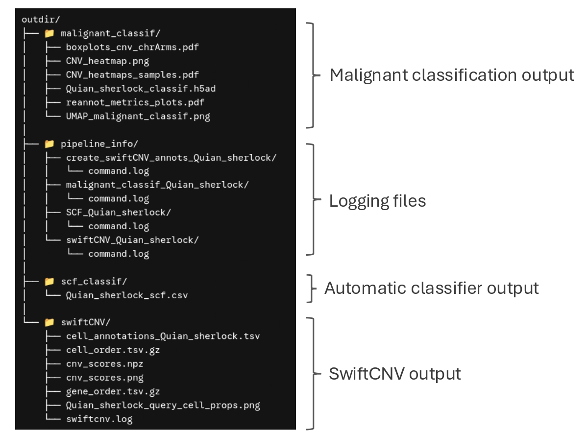
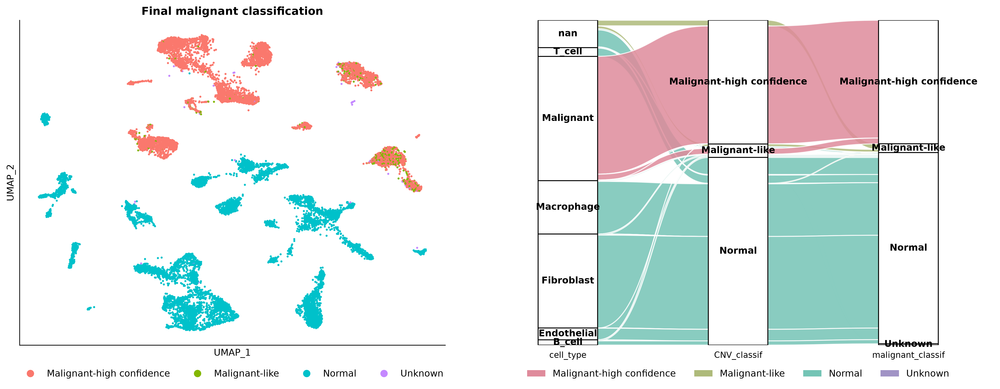
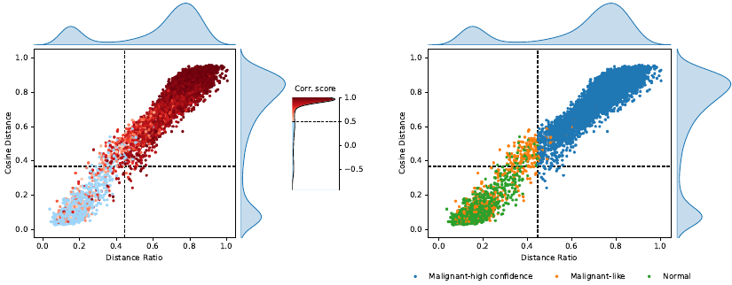

# SherlockCell  
`SherlockCell` is a nextflow pipeline for identifying malignant cells from single-cell RNA sequencing (scRNA-seq) data based on copy number variation (CNV) profiles and tumor heterogeneity features. It is built on [SwiftCNV](https://github.com/Computational-Immunogenomics/SwiftCNV), a fast and scalable Python implementation of the original [InferCNV](https://github.com/broadinstitute/inferCNV/wiki) algorithm extended with additional features. 

The pipeline comprises 3 different modules:

1. An automatic malignant cell classification using the [SCF classifier](https://github.com/Patchouli-M/SequencingCancerFinder) to define reference and query cells for SwitfCNV. 
2. CNV detection with SwiftCNV.
3. Malignant classification step.

## Documentation

An explanation of the malignant classification logic and steps can be found in...

## Installation

## Usage

The input parameters for SherlockCell are passed throught a samplesheet.tsv file containing these fields:

| dataset | adata_path | outdir | cell_origin | cell_type_key | sample_key | sample_type_key |
| :--- | :--- | :--- | :--- | :--- | :--- | :--- |
| datase_name | /path/to/adata.h5ad | /path/to/outdir | T-cells, Macrophages | cell_type | sample | sample_type |

## Output files

SherlockCell generates several reports for each step of the classification. An overview of all output files generated by the pipeline is shown in the figure below.

The image UMAP_malignant_classif shows the result of the malignant classification in the UMAP emmbedding.

  
  

Additionally, a figure showing the distributions of the three malignancy scores and the classification thresholds used for each sample is provided.

